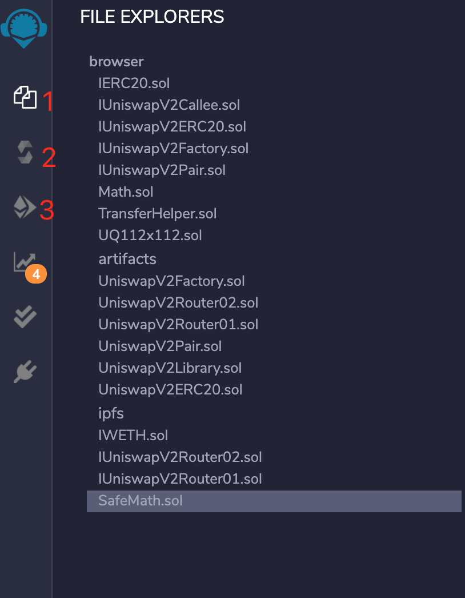
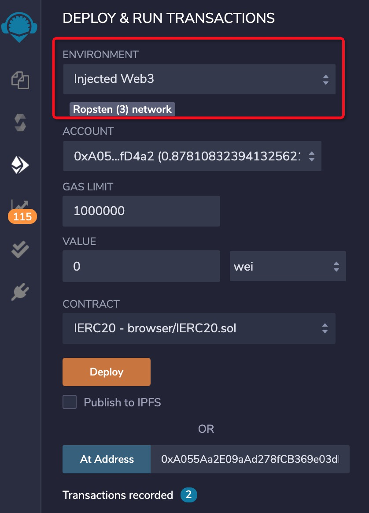

## uniswap

## prepare

opensource code
1. [uniswap-v2-core](https://github.com/Uniswap/uniswap-v2-core)
2. [uniswap-v2-periphery](https://github.com/Uniswap/uniswap-v2-periphery)
3. [uniswap-interface](https://github.com/Uniswap/uniswap-interface)

or you can use Use my [repo](https://github.com/LostPengK/uniswapRepo/tree/main/class),it's easier.

contract code
[factory contract](https://cn.etherscan.com/address/0x5C69bEe701ef814a2B6a3EDD4B1652CB9cc5aA6f#code)
[routerv2-contract](https://cn.etherscan.com/address/0x7a250d5630b4cf539739df2c5dacb4c659f2488d#code)

## deploy contract 
##### prepare a eth wallet account

1. a new wallet eth account,here is a video to help you to register a new account [video](https://www.youtube.com/watch?v=Y2mMnpmbAEc)
2. get some test eth [faucet](https://faucet.ropsten.be/)

##### prepare WETH contract address

The WETH contract is used to exchange Eth for Eth of erc20. Since Eth is not a token of erc20, we must use WETH as the exchange medium.
```
{
    mainnet:'0xC02aaA39b223FE8D0A0e5C4F27eAD9083C756Cc2',
    ropsten:'0xc778417E063141139Fce010982780140Aa0cD5Ab',
    rinkeby:'0xc778417E063141139Fce010982780140Aa0cD5Ab',
    goerli:'0xB4FBF271143F4FBf7B91A5ded31805e42b2208d6',
    kovan:'0xd0A1E359811322d97991E03f863a0C30C2cF029C'
}
```
choose a address. Here I use ropsten cause the test wallet account is based on ropsten.

#### use remix deploy contract
remix is a web IDE for Solidity. [remix](https://remix.ethereum.org/)

import the contract code you download above. choose contact code,import into remix file section.

picture1

picture1

picture1


##### step

1. deploy factory
    paramter is your eth account address,after deploy you can get a contract address. check if from you waller record,copy the transcation id to eth exporer,you will find the address.
    
2. deploy router
    paramters1 is factory address,paramters2 is WETH address above.separated by comma,after deploy you can get a router contract address.


#### deploy Uniswap front 

1. clone code
```
$ git clone https://github.com/Uniswap/uniswap-interface.git
```

2. Install dependent libraries
```
$ cd uniswap-interface
$ yarn
$ yarn start
```
3. If the operation is successful, a browser will be opened and the front-end interface of Uniswap will be opened at the same time.

#### update route address 
Uniswap's routing address is defined as a constant in the front-end of Uniswap. We only need to modify the routing address to make the front-end link to your routing contract

Modify the file: project directory/uniswap-interface/src/constants/index.ts line 6
```
import { AbstractConnector } from '@web3-react/abstract-connector'
import { ChainId, JSBI, Percent, Token, WETH } from '@uniswap/sdk'

import { fortmatic, injected, portis, walletconnect, walletlink } from '../connectors'

export const ROUTER_ADDRESS = '0x28Fd11da60B3e0874588Ae7370A266459aB32445' //change to your router address
```

now you can delopy your app to your server.

In this demo,I'll deploy it to my github.

1、 create github repo
2、remove origin file dir .git 
```
rm -rf .git
```
3、add front code to git repo
```
git init
git remote add origin https://github.com/{your project}.git
```

4、Install and deploy gh-pages
```
$ yarn add gh-pages
$ yarn build
```

5、update package.json
```
{
  "name": "@uniswap/interface",
  "description": "Uniswap Interface",
  "homepage": "your github project url",//update here
......

// 
......
"scripts": {
    ......
    "deploy": "gh-pages -d build" //add this line
  },
```

6、 deploy   
```
$ git add .
$ git commit -m "first commit"
$ git push
$ yarn deploy

```

7、wait a second ,open url: https://{yourname}.github.io/{projectname}/index.html then you can see your in your explorer
